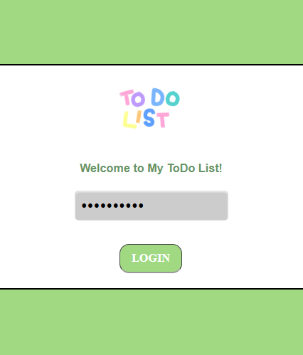
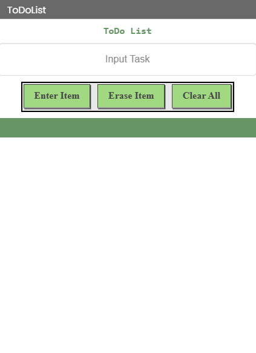

# To-Do List App

A simple mobile To-Do List application created using MIT App Inventor.

## About the Project

To-Do List is a simple productivity app designed to help users manage and keep track of their tasks.

The project was created as a mobile application project using MIT App Inventor. It explores basic mobile app development, user interaction, interface design, and programming logic through the App Inventor Blocks Editor.

## Features

- User login screen
- Password-based access
- Add and manage tasks
- To-Do List interface
- Simple and colorful user interface
- Interactive mobile experience

## Technology

- MIT App Inventor
- App Inventor Designer
- App Inventor Blocks Editor

## Demo

**Demo Password:** `12345`

> This password is provided only for testing the demo version of the application.

## Project Type

Educational / Personal Mobile Application Project

## My Role

I designed and developed the application using MIT App Inventor, including the user interface, application logic, and interactive components.

## What I Learned

Through this project, I learned how to:

- Design a simple mobile application interface
- Build application logic using visual programming blocks
- Create user interactions
- Organize and manage task-related data
- Test and refine a mobile application

## Application Preview

## Future Improvements

Possible improvements include:

- Task categories
- Task deadlines and reminders
- Task completion status
- Improved authentication
- More refined user interface
- Data persistence for storing tasks between sessions

## Project Status

Completed prototype / educational project.

## Note

This project was developed using MIT App Inventor and packaged as an Android APK.
